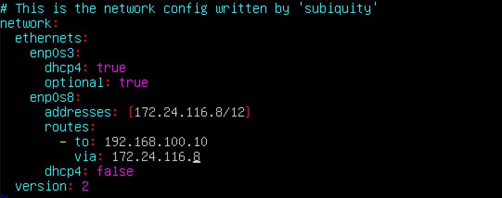
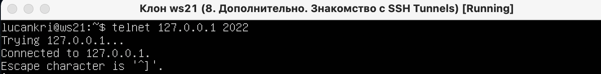

## 1. Инструмент ipcalc
### 1.1. Сети и маски
* Определить и записать в отчёт:
    1. Адрес сети 192.167.38.54/13:
    

    2. Перевод маски 255.255.255.0 в префиксную и двоичную запись, /15 в обычную и двоичную, 11111111.11111111.11111111.11110000 в обычную и префиксную
        * переводим 255.255.255.0 в префиксную и двоичную запись:
            * префиксная - /24
            * двоичная - 11111111.11111111.11111111.00000000  

        * переводим /15 в обычную и двоичную:
            * обычная - 255.254.0.0
            * двоичная - 11111111.11111110.00000000.00000000  

        * переводим 11111111.11111111.11111111.11110000 в обычную и префиксную
            * обычная - 255.255.255.240
            * префиксная - /28   

    3. Минимальный и максимальный хост в сети 12.167.38.4 при масках: /8, 11111111.11111111.00000000.00000000, 255.255.254.0 и /4
        * /8
        

        * 11111111.11111111.00000000.00000000
        

        * 255.255.254.0
        

        * /4
        

### 1.2. localhost
* Определить и записать в отчёт, можно ли обратиться к приложению, работающему на localhost, со следующими IP: 194.34.23.100, 127.0.0.2, 127.1.0.1, 128.0.0.1
    * 194.34.23.100 - нет
    * 127.0.0.2 - да
    * 127.1.0.1 - да
    * 128.0.0.1 - нет

### 1.3. Диапазоны и сегменты сетей
* Определить и записать в отчёт:
    1. какие из перечисленных IP можно использовать в качестве публичного, а какие только в качестве частных: 10.0.0.45, 134.43.0.2, 192.168.4.2, 172.20.250.4, 172.0.2.1, 192.172.0.1, 172.68.0.2, 172.16.255.255, 10.10.10.10, 192.169.168.1
        * пучбличные:
            * 134.43.0.2
            * 172.0.2.1
            * 192.172.0.1
            * 172.68.0.2
            * 192.169.168.1
        * частные:
            * 10.0.0.45
            * 192.168.4.2
            * 172.20.250.4
            * 172.16.255.255
            * 10.10.10.10
              

    2. какие из перечисленных IP адресов шлюза возможны у сети 10.10.0.0/18: 10.0.0.1, 10.10.0.2, 10.10.10.10, 10.10.100.1, 10.10.1.255
        * 10.10.0.2
        * 10.10.10.10
        * 10.10.1.255

## 2. Статическая маршрутизация между двумя машинами
* С помощью команды ip a посмотреть существующие сетевые интерфейсы
    
    > машина - ws1

    
    > машина - ws2

* Описать сетевой интерфейс, соответствующий внутренней сети, на обеих машинах и задать следующие адреса и маски: ws1 - 192.168.100.10, маска /16, ws2 - 172.24.116.8, маска /12
    * Описание сетевого интерфейса: 
    У обеих машин присутствует интерфейс lo - loopback, для связи программ между собой, с адресом 127.0.0.1/8. ws1 - интерфейс enp0s3, адрес 10.0.2.15/24, brd(broadcast) - 10.0.2.255, он работает (UP).<bt/> ws2 - интерфейс enp0s3, адрес 10.0.2.255, brd(broadcast) - 10.0.2.255, он работает (UP) brd - широковещательный адрес, последний из возможных хостов для каждой сети и маски.

    * Задаем следующие адреса и маски: ws1 - 192.168.100.10, маска /16, ws2 - 172.24.116.8, маска /12

        
        > машина - ws1

        
        > машина - ws2

* Выполнить команду `sudo netplan apply` для перезапуска сервиса сети

    
    > машина - ws1

    
    > машина - ws2

### 2.1. Добавление статического маршрута вручную
* Добавляем статический маршрут от одной машины до другой и обратно при помощи команды вида ip r add

    
    > машина - ws1

    
    > машина - ws2

* "Пингуем" соединение между машинами

    
    > машина - ws1

    
    > машина - ws2

### 2.2. Добавление статического маршрута с сохранением
* Перезапускаем машины

    
    > машина - ws1

    
    > машина - ws2

* Добавляем статический маршрут от одной машины до другой с помощью файла etc/netplan/00-installer-config.yaml
    
    > машина - ws1

    
    > машина - ws2

* "Пингуем" соединение между машинами
    
    > машина - ws1

    
    > машина - ws2

## 3. Утилита iperf3
### 3.1. Скорость соединения
* Перевести и записать в отчёт: 8 Mbps в MB/s, 100 MB/s в Kbps, 1 Gbps в Mbps
    * 8 Mbps в MB/s = 1 MB/s
    * 100 MB/s в Kbps = 819200 Kbps
    * 1 Gbps в Mbps = 1024 Mbps

### 3.2. Утилита iperf3
* Измерить скорость соединения между ws1 и ws2
    * Чтобы проверить пропускную способность сети, нам нужно сначала подключиться к удаленной машине, которую мы будете использовать в качестве сервера, и запустить `iperf3` в режиме сервера, используя флаг -s, по умолчанию он будет прослушивать порт 5201. Запускаем кманду: `iperf3 -s` (в режиме сервера я выбрал машину - ws1). 
    `-s` - для запуска в режиме сервера 
    `-f` -  можно переключить формат чтоб выводил в отчете (k, m, g для кбит, мегабит, гигабит или K, M, G для килобайт, мегабайт, гигабайт). 
    Зпускаем команду: `iperf3 -c 192.168.100.10` (для клиента выбрал машину - ws2) 
    `-c` - клиент 
    `192.168.100.10` -  адрес сервера  
        
        > машина - ws1

        
        > машина - ws2

## 4. Сетевой экран
### 4.1. Утилита iptables
* Создаем файл /etc/firewall.sh, имитирующий фаерволл, на ws1 и ws2:
    * что бы создать файл firewall.sh вводим команду на обеих машинах: `sudo touch /etc/firewall.sh`

* Нужно добавить в файл подряд следующие правила:
    1. на ws1 применить стратегию когда в начале пишется запрещающее правило, а в конце пишется разрешающее правило (это касается пунктов 4 и 5)

    2. на ws2 применить стратегию когда в начале пишется разрешающее правило, а в конце пишется запрещающее правило (это касается пунктов 4 и 5)

    3. открыть на машинах доступ для порта 22 (ssh) и порта 80 (http)

    4. запретить echo reply (машина не должна "пинговаться”, т.е. должна быть блокировка на OUTPUT)

    5. разрешить echo reply (машина должна "пинговаться")

    Скрины с содержанием файла `firewall.sh` для каждой машины:
    
    > машина - ws1

    
    > машина - ws2

* Запускаем файлы на обеих машинах командами `sudo chmod +x /etc/firewall.sh` и `sudo sh /etc/firewall.sh`

    
    > машина - ws1

    
    > машина - ws2

    * В отчёте описать разницу между стратегиями, применёнными в первом и втором файлах. 
    По сути, разница в том, что одна машина доставит сообщение о том, что пакеты получены, а вторая не отправит такое сообщение, так как у ws1 вторым правилом стоит разрешение echo-reply, а у ws2 последнее правило запрещает echo-reply. 
    `Запрещающее правило не перезаписывается на разрешающее правило`

### 4.2. Утилита nmap
* Командой ping найти машину, которая не "пингуется", после чего утилитой nmap показать, что хост машины запущен
    * находим машину которая не "пингуется"
    
        > "Пингуем" машину - ws1, на машине - ws2

    * утилитой nmap показываем, что хост машины запущен
    
        > Проверяем что хост машины - ws1 запущен

* Сохраняем дампы образов виртуальных машин

## 5. Статическая маршрутизация сети

*  Поднять пять виртуальных машин (3 рабочие станции (ws11, ws21, ws22) и 2 роутера (r1, r2))

### 5.1. Настройка адресов машин
* Настраиваем конфигурации машин в etc/netplan/00-installer-config.yaml согласно сети на рисунке.
    
    > машина - r1

    
    > машина - r2

    
    > машина - ws11

    
    > машина - ws21

    
    > машина - ws22

* Перезапустить сервис сети. Если ошибок нет, то командой `ip -4 a` проверить, что адрес машины задан верно. Также пропинговать ws22 с ws21. Аналогично пропинговать r1 с ws11.
    * Перезапускаем сервис сети. Если ошибок нет, то командой `ip -4 a` проверить, что адрес машины задан верно
        
        > машина - r1

        
        > машина - r2

        
        > машина - ws11

        
        > машина - ws21

        
        > машина - ws22

    * Также пропинговать ws22 с ws21
        
        > машина - ws21
    * Аналогично пропинговать r1 с ws11
        
        > машина - ws11

### 5.2. Включение переадресации IP-адресов
* Для включения переадресации IP, выполните команду на роутерах:
    * выполняем команду `sysctl -w net.ipv4.ip_forward=1` 
    При таком подходе переадресация не будет работать после перезагрузки системы.
        
        > машина - r1

        
        > машина - r2

* Откройте файл `/etc/sysctl.conf` и добавьте в него следующую строку:
`net.ipv4.ip_forward = 1` 
При использовании этого подхода, IP-переадресация включена на постоянной основе.
    
    > машина - r1

    
    > машина - r2

### 5.3. Установка маршрута по-умолчанию
* Настроить маршрут по-умолчанию (шлюз) для рабочих станций. Для этого добавить gateway4 [ip роутера] в файле конфигураций
    
    > машина - r1

    
    > машина - r2

    
    > машина - ws11

    
    > машина - ws21

    
    > машина - ws22

* Вызвать `ip r` и показать, что добавился маршрут в таблицу маршрутизации
    
    > машина - r1

    
    > машина - r2

    
    > машина - ws11

    
    > машина - ws21

    
    > машина - ws22

* Пропинговать с ws11 роутер r2 и показать на r2, что пинг доходит. Для этого использовать команду: `tcpdump -tn -i eth1`
    
    > машина - r2

    
    > машина - ws11

### 5.4. Добавление статических маршрутов
* Добавляем в роутеры r1 и r2 статические маршруты в файле конфигураций

    
    > машина - r1

    
    > машина - r2

* Вызываем `ip r` и показываем таблицы с маршрутами на обоих роутерах

    
    > машина - r1

    
    > машина - r2

* Запустить команды на ws11: 
`ip r list 10.10.0.0/[маска сети]` и `ip r list 0.0.0.0/0`

    
    > машина - ws11

    * В отчёте объяснить, почему для адреса 10.10.0.0/[порт сети] был выбран маршрут, отличный от 0.0.0.0/0, хотя он попадает под маршрут по-умолчанию.
        > Адрес 0.0.0.0 - не маршрутизируемый мета-адрес, который используется для определения неизвестного или недействительного целевого объекта. 
        0.0.0.0 означает все адреса IPv4 на локальной машине, в случае записи маршрута это означает маршрут по умолчанию.

### 5.5. Построение списка маршрутизаторов
* Запустить на r1 команду дампа: `tcpdump -tnv -i eth0`
    
    > машина - r1

* При помощи утилиты traceroute построить список маршрутизаторов на пути от ws11 до ws21
    
    > вывод команды `traceroute 10.20.0.10`  на машине - ws11

    
    > вывод команды `tcpdump -tnv -i eth0`

    * В отчёте, опираясь на вывод, полученный из дампа на r1, объяснить принцип работы построения пути при помощи `traceroute`. 
        > traceroute отрправляет серию пакетов целевому узлу, который есть в пути следования от одной машины к другой, каждый раз увеличивая на 1 значение поля TTL, который отображает кол-во маршрутизаторов, возможных для прохождения пакетом. Процесс будет продолжаться до тех пор, пока при определенном значении TTL пакет не достигнет целевого узла - если достиг, процесс считается завершенным. 
        `TTL` - Time to live (TTL) – это время жизни пакета. TTL показывает максимальный период времени существования набора данных (пакета). - Основное назначение – не допустить длительной задержки, когда, например, в процессе передачи данных маршрутизатор отключился или была потеряна связь между двумя узлами.

### 5.6. Использование протокола ICMP при маршрутизации
* Запустить на r1 перехват сетевого трафика, проходящего через eth0 с помощью команды: `tcpdump -n -i eth0 icmp`
    
    > машина - r1
    
    
    > вывод команды `tcpdump -n -i eth0 icmp` на машине - r1

* Пропинговать с ws11 несуществующий IP (например, 10.30.0.111) с помощью команды: `ping -c 1 10.30.0.111`
    
    > вывод команды `ping -c 1 10.30.0.111` на машине - ws11

#### Сохраняем дампы образов виртуальных машин!

## 6. Динамическая настройка IP с помощью DHCP
* Для r2 настроить в файле `/etc/dhcp/dhcpd.conf` конфигурацию службы DHCP: 
    1. указываем адрес маршрутизатора по-умолчанию, DNS-сервер и адрес внутренней сети
    
        > машина - r2

    2. в файле resolv.conf прописать nameserver 8.8.8.8
    
        > машина - r1

* Перезагрузить службу DHCP командой `systemctl restart isc-dhcp-server`. Машину ws21 перезагрузить при помощи reboot и через ip a показать, что она получила адрес. Также пропинговать ws22 с ws21.
    * Перезагружаем службу DHCP командой `systemctl restart isc-dhcp-server`
    
        > машина - r1

    * Машину ws21 перезагружаем при помощи reboot и через ip a показать, что она получила адрес
    
    
        > машина - r1

    * Также пропингуем ws22 с ws21
    
        > машина - ws21

* Указываем MAC адрес у ws11, для этого в etc/netplan/00-installer-config.yaml надо добавить строки: macaddress: `10:10:10:10:10:BA`, `dhcp4: true`
    
    > машина - ws11

* Для r1 настроить аналогично r2, но сделать выдачу адресов с жесткой привязкой к MAC-адресу (ws11). Провести аналогичные тесты

    1. указываем адрес маршрутизатора по-умолчанию, DNS-сервер и адрес внутренней сети, делаем выдачу адресов с жесткой привязкой к MAC-адресу
    
        > машина - r1

    2. в файле resolv.conf прописать nameserver 8.8.8.8
    
        > машина - r1

* Перезагрузить службу DHCP командой `systemctl restart isc-dhcp-server`. Машину ws11 перезагрузить при помощи reboot и через ip a показать, что она получила адрес
    * Перезагружаем службу DHCP командой `systemctl restart isc-dhcp-server`
    
        > машина - r1

    * Машину ws11 перезагружаем при помощи `reboot` и через `ip a` показать, что она получила адрес
    
        > машина - ws11

    * Также пропингуем ws22 с ws11
    
        > машина - ws11

* Запросить с ws21 обновление ip адреса
    
        > машина - ws21

    * команда `sudo dhclient -r [имя сетевого интерфейся]` - чтобы удалить существующие адреса.  
    команда `sudo dhclient [имя сетевого интерфейся]` - выдается адрес для определенного интерфейса.

## 7. NAT
* В файле `/etc/apache2/ports.conf` на ws22 и r1 изменить строку Listen 80 на Listen 0.0.0.0:80, то есть сделать сервер Apache2 общедоступным
    
    > машина - r1

    
    > машина - ws22

* Запустить веб-сервер Apache командой service apache2 start на ws22 и r1
    
    > машина - ws22

    
    > машина - r1

* Добавить в фаервол, созданный по аналогии с фаерволом из Части 4, на r2 следующие правила:
    1. Удаление правил в таблице filter - `iptables -F`
    2. Удаление правил в таблице "NAT" - `iptables -F -t nat`
    3. Отбрасывать все маршрутизируемые пакеты - `iptables --policy FORWARD DROP`
    
        > машина - r2

* Запускать файл также, как в Части 4 с помощью команд:
    1. `chmod +x /etc/firewall.sh` - дать доступ к скрипту
    2. `sh /etc/firewall.sh` - запустить скрипт

* Проверить соединение между ws22 и r1 командой ping
    * При запуске файла с этими правилами, ws22 не должна "пинговаться" с r1
    
        > машина - r1

* Добавить в файл ещё одно правило:
    4. Разрешить маршрутизацию всех пакетов протокола ICMP
    
    > машина - r2

* Запускать файл также, как в Части 4 с помощью команд:
    1. `chmod +x /etc/firewall.sh` - дать доступ к скрипту
    2. `sh /etc/firewall.sh` - запустить скрипт

* Проверить соединение между ws22 и r1 командой ping
    
    > машина - r1

* Добавить в файл ещё два правила:
    1. Включить SNAT, а именно маскирование всех локальных ip из локальной сети, находящейся за r2 (по обозначениям из Части 5 - сеть 10.20.0.0)
    
        > машина - r2

    2. Включить DNAT на 8080 порт машины r2 и добавить к веб-серверу Apache, запущенному на ws22, доступ извне сети
    
        > машина - r2

* Запускать файл также, как в Части 4 с помощью команд:
    1. `chmod +x /etc/firewall.sh` - дать доступ к скрипту
    2. `sh /etc/firewall.sh` - запустить скрипт

* Проверить соединение по TCP для SNAT, для этого с ws22 подключиться к серверу Apache на r1 командой: `telnet [адрес] [порт]`

* Проверить соединение по TCP для DNAT, для этого с r1 подключиться к серверу Apache на ws22 командой telnet (обращаться по адресу r2 и порту 8080)

    > машина - r1

## 8. Дополнительно. Знакомство с SSH Tunnels
* Запустить на r2 фаервол с правилами из Части 7

    > машина - r2

* Запустить веб-сервер Apache на ws22 только на localhost (то есть в файле /etc/apache2/ports.conf изменить строку `Listen 80` на `Listen localhost:80`)

    > машина - ws22

* Воспользоваться Local TCP forwarding с ws21 до ws22, чтобы получить доступ к веб-серверу на ws22 с ws21 
    * На машине ws21 вводим команду `ssh -L 8080:localhost:80 lucankri@10.20.0.20`
        
        > машина - ws21
    * Для проверки, сработало ли подключение в обоих предыдущих пунктах, перейдите во второй терминал (например, клавишами Alt + F2) и выполните команду: `telnet 127.0.0.1 [локальный порт]`
        
        > машина - ws21
* Воспользоваться Remote TCP forwarding c ws11 до ws22, чтобы получить доступ к веб-серверу на ws22 с ws11
    * На машине ws21 вводим команду `ssh -R 8080:localhost:80 lucankri@10.20.0.20`
    
        > машина - ws22
    * Для проверки, сработало ли подключение в обоих предыдущих пунктах, перейдите во второй терминал (например, клавишами Alt + F2) и выполните команду: `telnet 127.0.0.1 [локальный порт]`
    
        > машина - ws11
